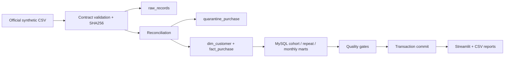

# 架构与运行设计

所有数据均在专属数据库中。一次刷新使用 MySQL GET_LOCK 互斥、InnoDB 事务和 DELETE + INSERT。
SQL 检查失败则回滚并保留上次可用快照；schema DDL 在事务刷新前运行，首次失败可能留下空表。
pipeline_runs 单独记录运行状态、源文件哈希和观察窗口。raw_records 保存当前快照的原始 JSON；历史原始文件由使用者自行归档。
这是面向约 30 万源记录的批处理项目，采用全量幂等刷新，不宣称已实现增量 CDC 或分布式实时处理。
导入使用参数化批量 INSERT；关键查询有 user/date/line、date/line 和 cohort/line 索引。

## 运行与故障排查

- 数据源断网：重试下载，或自行从官方仓库取得原文件放入 data/raw，再去掉 --download。
- 端口冲突：修改 Compose 左侧宿主机端口，不修改容器 MYSQL_PORT。
- 质量失败：查看异常、pipeline_runs 与 docs/metric-contract.md；修复后重跑。
- 正在刷新：GET_LOCK 拒绝并行任务，稍后重试。
- SQL 导出文件只在成功提交后生成；MySQL 为权威快照，CSV 导出失败可重跑恢复。
- 看板默认在本机 8501 端口，数据库在本机 3307 端口。示例密码仅供本机演示；公网部署需自行配置凭据、访问控制和 TLS。
- `docker compose stop` 停止服务并保留数据卷；常规验证不使用删除数据卷命令。

## 测试策略

单元测试验证 CSV BOM、字段、未知用户、冲突、重复和日期边界。
MySQL 集成测试使用独立 *_test 数据库和手算 fixture，验证留存分母、同业务线/平台差异、空月为零、未完成月为 NULL、30 天复购资格，以及重复执行与中途失败回滚。
GitHub Actions 在 MySQL 8.0.42 上运行同一套测试，不依赖外部业务数据下载。
