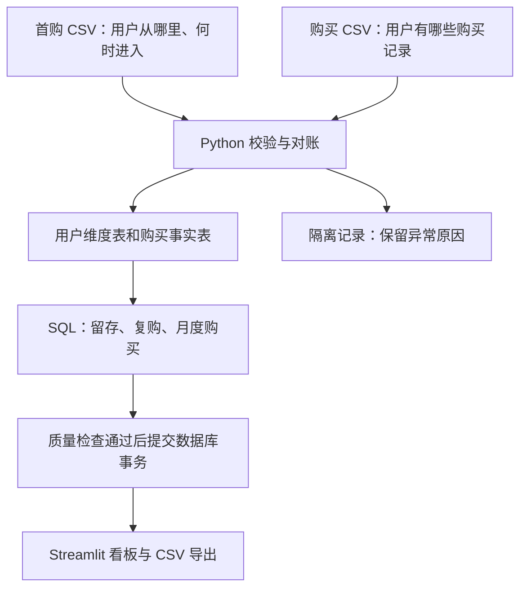

# Wolt 用户留存与复购分析：中文项目讲解

## 这个项目在做什么

这是 Wolt 用户留存与复购分析项目：把餐饮和零售的购买记录，变成能解释用户留存与复购的数据库、报表和交互看板。

它回答三个问题：用户第一次购买之后，后面几个月还会回来吗？首购后 30 天内会再次购买吗？从餐饮进入的用户会不会买零售，反过来又怎么样？

项目使用公开合成数据。数据来源与项目实现是两个不同部分：来源在 [指标口径文档](metric-contract.md) 中说明，这里的重点是数据处理、SQL 模型、看板与分析过程。

## 从输入到输出



Python 负责读文件、检查数据、对账与控制执行；MySQL 负责存储和计算指标；Streamlit 负责让使用者筛选、查看和下载结果。

## 第一步：先把数据对上

输入文件是 `first_purchases.csv` 和 `purchases.csv`。两者都有用户 ID、订单 ID、商家 ID、业务线和日期，首购文件的日期列叫 `first_purchase_date`。

首购表决定用户属于哪个获客月份、哪条首购业务线。当前快照的两份文件没有重复订单 ID，因此需要把首购事件也放进购买事实表。不能只读取购买文件，否则会遗漏首购事件，也容易遗漏没有后续购买的用户。

对账时，完全相同的订单去重；同一个订单 ID 对应不同内容则报错。缺少首购记录的用户、发生在已知首购之前的购买进入隔离表，保存原因，便于追查。

仓库保存的运行快照可以这样核对：

```text
71,257 条首购 + 227,457 条购买 - 10,145 条隔离 = 288,569 条购买事件
```

这是该快照的结果；此时没有重复订单。10,145 条隔离事件涉及 3,311 个缺少首购锚点的用户。后续更换数据时，应以新的运行日志为准。

对应代码：[data.py](../src/wolt_analytics/data.py) 的 `read_source()` 和 `reconcile()`。

## 第二步：建立数据库的不同层次

| 表 | 一行代表什么 | 用途 |
|---|---|---|
| `raw_records` | 一条原始文件记录 | 保存原始 JSON 和来源行号，便于追查 |
| `quarantine_purchase` | 一条隔离购买记录 | 保存异常原因 |
| `dim_customer` | 一个首购用户 | 固定首购日期、首购订单与获客业务线 |
| `fact_purchase` | 一笔对账后的购买 | 支持按用户、日期、业务线统计 |
| `mart_retention` | 一个获客分组在一个月份的表现 | 留存热力图 |
| `mart_repurchase` | 一条首购业务线的 30 天统计 | 复购与跨线购买对比 |
| `mart_monthly` | 一个完整月份、一条业务线 | 月度购买事件数与购买用户数 |
| `pipeline_runs` | 一次运行 | 记录成功或失败、文件哈希与结果摘要 |

其中“维度表”描述用户，“事实表”记录购买，“汇总表”保存看板需要的统计结果。表定义见 [01_schema.sql](../sql/01_schema.sql)，写入流程见 [cli.py](../src/wolt_analytics/cli.py)。

## 第三步：理解三个核心指标

### 月度留存：同一批用户后面有没有回来

Cohort（同期群）就是“首购月份相同、首购业务线相同”的一批用户。

举一个手算例子：5 月首次买餐饮的用户有 100 人，6 月有 20 人回来购买，其中 15 人买了餐饮。于是 6 月的平台留存为 `20 / 100 = 20%`，同业务线留存为 `15 / 100 = 15%`。这里的数字仅用于讲解。

分母始终是最初的 100 人，包括再也没回来的用户。分子按不同用户数计算，一个人买十次仍然只算一个回访用户。平台留存允许用户买任意业务线，同业务线留存要求购买与首购相同的业务线。

M0 是首购所在的日历月，M1 是下一个日历月。例如 5 月 31 日首购，6 月购买就计入 M1。它和“首购后 30 天”使用不同的时间窗口。

### 30 天复购：首购之后有没有另一笔订单

先选出从首购日起拥有完整 30 天观察期的用户，再检查首购日到第 30 天内是否存在另一笔不同 ID 的订单。两端日期都包含，同日另一订单也计入，因为源数据只有日期精度。

```text
30 天复购率 = 窗口内存在另一笔订单的用户数 / 拥有完整观察期的首购用户数
```

不能把刚首购两天的用户算进分母，否则他们还没有同等时间复购。代码还要求首购日期不早于声明的观察起点。

### 30 天跨线购买：有没有购买另一条业务线

在同一观察窗口里，首购餐饮用户买了零售，或首购零售用户买了餐饮，就记为跨线购买。分母与 30 天复购率相同，每个用户最多计一次。

当前实现检查“另一笔订单的业务线是否不同”，日期精度不足以判断同日订单的先后顺序。SQL 实现在 [02_marts.sql](../sql/02_marts.sql)。

## 第四步：避免把“没观察到”当成“没人回来”

观察窗口采用 2020-04-21 至 2020-10-31 的数据覆盖假设，完整月份是 5—10 月。

如果完整观察了一个月，没有人回来，留存是 `0`；如果只观察了部分月份，留存是 `NULL`，看板显示空白。4 月的数据从 21 日开始，所以不计算完整 4 月留存。3、4 月首购用户仍可计算 5 月之后的回访。

9 月首购文件只到 21 日，因此该获客分组覆盖部分月份，不能直接用它的用户规模推断整月获客趋势。观察日期可以配置，但扩大日期必须有相应数据覆盖依据。

## 第五步：为什么重复运行不会不断累加

刷新使用事务中的 `DELETE + INSERT`，替换当前分析快照。处理期间用 MySQL `GET_LOCK` 避免两个任务同时刷新；7 项数据质量检查通过后才提交。如果提交之前失败，回滚后保留上次已提交的数据。

检查包括购买是否有对应用户、购买是否早于首购、比率是否越界、未完整观察的留存是否为空、可观察 M0 是否为 100%、同线回访人数是否超过平台回访人数，以及复购和跨线人数是否满足大小关系。

建表在数据刷新事务之前执行，首次失败可能留下空表。CSV 导出在数据库提交后执行，导出失败时数据库仍保留成功快照，可以重跑生成文件。具体流程见 [架构文档](architecture.md)。

## 现有结果怎么解释

以下来自仓库保存的 [run-summary.json](run-summary.json)，不是本次文档修改重新执行的统计结果。

| 首购业务线 | 符合 30 天观察条件的用户 | 复购用户 | 复购率 | 跨线用户 | 跨线率 |
|---|---:|---:|---:|---:|---:|
| 餐饮 | 51,957 | 6,883 | 13.25% | 141 | 0.27% |
| 零售 | 331 | 61 | 18.43% | 47 | 14.20% |

零售组复购率高约 5.18 个百分点，但只有 331 个用户。可以据此提出进一步分析的方向，例如按获客月份或渠道检查差异；现有数据不支持把差异解释为某个运营动作的效果。报告的价值在于识别现象、说明分母、提出下一步验证问题。

## 讲述项目时可以采用的顺序

先说明业务问题：希望了解新用户的持续购买和跨业务线行为。接着说明数据问题：两份文件难以直接对账，未知首购用户不能直接分组。然后讲解决方案：首购锚点、异常隔离、用户和订单建模、统一观察窗口。最后展示留存图、复购结果与运行保障。

可用下面这段介绍项目，再结合自己实际完成和掌握的部分展开：

> 这是我的 Wolt 用户留存与复购分析项目，使用公开合成数据研究餐饮和零售用户的购买行为。系统用 Python 校验和对账，用 MySQL 构建用户、购买和指标汇总表，再通过 Streamlit 展示月度留存、30 天复购和跨业务线购买。项目重点是统一指标分母与观察窗口，并通过质量检查和事务刷新保证结果可重复验证。

建议按 `data.py → 01_schema.sql → 02_marts.sql → cli.py → dashboard/app.py` 的顺序读代码，再用 [test_mysql.py](../tests/test_mysql.py) 中的小样本手算指标。能解释“分母为什么保留未复购用户”“空白和零的区别”“两种留存的区别”，就掌握了这个项目最关键的分析逻辑。
